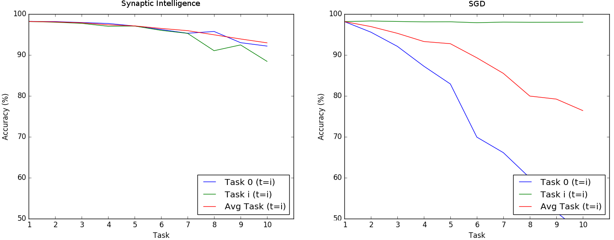
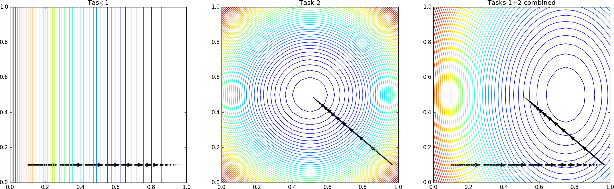

# TF_ContinualLearningViaSynapticIntelligence
TensorFlow implementation of the `intelligent synapse' model from [Zenke et al., (2017)] and application to the Permuted MNIST benchmark.

This project re-implements the model by Zenke, Poole and Ganguli (2017) in TensorFlow and tests it on the Permuted MNIST benchmark. The Permuted MNIST is a sequence of classification tasks in which the pixels of the input images are swapped with a random permutation specific to each task.

As part of the project, source is provided to visualize the learning trajectory in weights space in a bidimensional dummy case.

The implementation can be compared against normal Stochastic Gradient Descent by disabling the auxiliary weights-protection loss (`param_c=0') in each source file.

### Results
Performance for Synaptic Intelligence (left) is still at 93% after training on 10 Permuted MNIST tasks. On the contrary, standard Stochastic Gradient Descent is around 76%.

Trajectory in weights space while optimizing two Tasks in sequence, Task 1 first (left) followed by Task 2 (center). The contour plots outline the error surface for each task, together with their joint one (average of the two) in the right panel.

The model by Zenke et al. (2017) effectively manages to mitigate the problem, converging near the correct multi-task minimum.

### References.

Zenke, F., Poole, B., & Ganguli, S. (2017). Improved multitask learning through synaptic intelligence. arXiv preprint https://arxiv.org/abs/1703.04200

